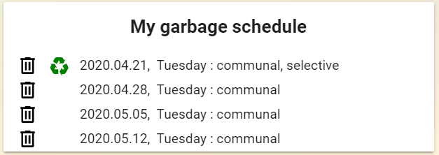

<p><a href="https://www.buymeacoffee.com/6rF5cQl" rel="nofollow" target="_blank"></a></p>

# FKF Budapest Garbage Collection Card for Home Assistant

This Lovelace custom card displays garbage collection schedule provided by
the FKF Garbage Collection custom component you may find at
[https://github.com/amaximus/fkf-garbage-collection](https://github.com/amaximus/fkf-garbage-collection/).<br />
It will draw your attention the day before the garbage collection by changing the description to red by default.

Lovelace UI does not support platform attributes natively.<br />
Implementation of handling attributes in Lovelace was inspired by [entity-attributes-card](https://github.com/custom-cards/entity-attributes-card).

#### Installation
The easiest way to install it is through [HACS (Home Assistant Community Store)](https://custom-components.github.io/hacs/),
search for <i>garbage</i> and select FKF Budapest Garbage Collection Card from Plugins.<br />
If you are not using HACS, you may download fkf-garbage-collection-card.js and the translations directory and put them into
homeassistant_config_dir/www/community/fkf-garbage-collection-card/ directory.<br />

#### Lovelace UI configuration
Configuration parameters:<br />

**entity** (required): name of the sensor of fkf_garbage_collection platform.<br />
**due_color** (optional): description color on due date. Accepts both color names and RGB values. Defaults to red.<br />
**due_1_color** (optional): description color on the day before due date. Accepts both color names and RGB values. Defaults to due_color.<br />
**hide_date** (optional): hide date. Defaults to false.<br />
**hide_days** (optional): hide number of days. Defaults to false.<br />
**hide_text** (optional): hide description. Defaults to false.<br />
**hide_wday** (optional): hide weekday. Defaults to false.<br />
**hide_before** (optional): hide entire card until x days before event.  Defaults to not hiding card.<br />
**icon_size** (optional): size of the icons. Defaults to 25px.<br />
**next_only** (optional): display only the first upcoming date. Defaults to 14px.<br />
**title** (optional): card title. Defaults to empty string.<br />

Please find below an example of ui-lovelace.yaml (entity should be the sensor of garbage_collection platform you defined):

```
resources:
  *When using HACS installation method
  - {type: js, url: '/local/community/fkf-garbage-collection-card/fkf-garbage-collection-card.js'}
    cards:
      - type: custom:fkf-garbage-collection-card
        entity: sensor.my_garbage_schedule
        title: 'My garbage schedule'
        icon_size: 35px
        hide_date: true
```

Card alerting:<br />


Card hiding number of days:<br />

